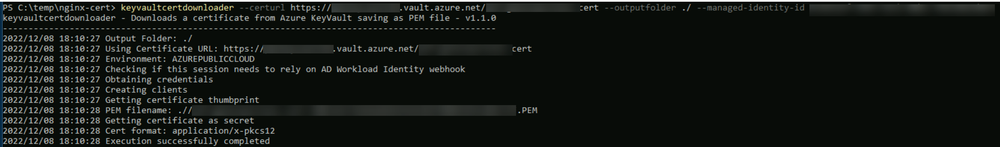

# keyvaultcertdownloader

Source code for a tool that performs downloads managed certificates from KeyVault in PEM file format, these certificates can be self-signed or issued by an Azure KeyVault integrated CA (e.g. Digicert).

> Note: This tool is provided as sample code purposes only, no support of any kind will be provided, for more details, please see [LICENSE](./LICENSE).

## Requirements
* Azure Subscription
* Azure Key Vault
* Certificate managed through Key Vault (self-signed or issued by integrated CA)
* Identity used to authenticate with the tool must have the following access policy set up in KeyVault:
    * Secret -> Get
    * Certificate -> Get

## What does the tool do
It gets a certificate from KeyVault using a managed identity assigned to a VM (available only if the VM is in Azure and has an identity enabled), or it will use the following environment variables (whichever is available with the environment variables tried first):

* AZURE_CLIENT_ID
* AZURE_CLIENT_SECRET
* AZURE_TENANT_ID

After authentication takes place, it first checks if the certificate in KeyVault already exists within the file system through checking the X509Thumbprint (from the certificate bundle) attribute of the cert and check if a file with the following name format already exists:

`<KeyVault CertName>-<bundle thumbprint>.PEM`

Finally, if the certificate from is new, it then extracts the certificate and private from the bundle (leaving CA certs out) and generates the PEM file with the name format described above so it can be consumed by other applications.

> Note: if you need to convert the cert to PFX file after the PEM file is downloaded you can use the following openssl command line to perform the conversion:
> `openssl pkcs12 -inkey <Full path to PEM File> -in<Full path to PEM File> -export -out <Full path for new PFX file>`

### Screenshot

## Parameters

* **certulr** - This is the KeyVault URL followed by the certificate name. E.g. https://mykeyvault.vault.azure.net/vm-cert
* **outputfolder** - Folder where the PEM file with the Certificate and its Private Key will be saved, it must exist beforehand, the tool will not create it and will also not manage permissions on the files
* **version** - shows current tool version
* **managed-identity-id** - Uses user managed identities (accepts resource id or client id)
* **use-system-managed-identity** - Uses system managed identity
  
## Exit Error Codes
| Error                      | Exit Code |
|----------------------------|-----------|
| ERR_AUTHORIZER             | 2         |
| ERR_INVALID_ARGUMENT       | 3         |
| ERR_INVALID_URL            | 4         |
| ERR_GET_AKV_CERT_SECRET    | 5         |
| ERR_GET_PEM_PRIVATE_KEY    | 6         |
| ERR_GET_PEM_CERTIFICATE    | 7         |
| ERR_CREATE_PEM_FILE        | 8         |
| ERR_X509_THUMBPRINT        | 9         |
| ERR_OUTPUTFOLDER_NOT_FOUND | 10        |
| ERR_INVALID_AZURE_ENVIRONMENT | 11 |
| ERR_CREDENTIALS | 12 |
| ERR_INVALID_CREDENTIAL_ARGS | 13 |

# Related Information
* [Managed Identities For Azure Resources](https://docs.microsoft.com/en-us/azure/active-directory/managed-identities-azure-resources/overview)
* [Provide Key Vault authentication with an access control policy](https://docs.microsoft.com/en-us/azure/key-vault/key-vault-group-permissions-for-apps)
* [Azure Key Vault Documentation](https://docs.microsoft.com/en-us/azure/key-vault/)

# Contribute
This project welcomes contributions and suggestions.  Most contributions require you to agree to a
Contributor License Agreement (CLA) declaring that you have the right to, and actually do, grant us
the rights to use your contribution. For details, visit https://cla.opensource.microsoft.com.

When you submit a pull request, a CLA bot will automatically determine whether you need to provide
a CLA and decorate the PR appropriately (e.g., status check, comment). Simply follow the instructions
provided by the bot. You will only need to do this once across all repos using our CLA.

This project has adopted the [Microsoft Open Source Code of Conduct](https://opensource.microsoft.com/codeofconduct/).
For more information see the [Code of Conduct FAQ](https://opensource.microsoft.com/codeofconduct/faq/) or
contact [opencode@microsoft.com](mailto:opencode@microsoft.com) with any additional questions or comments.
