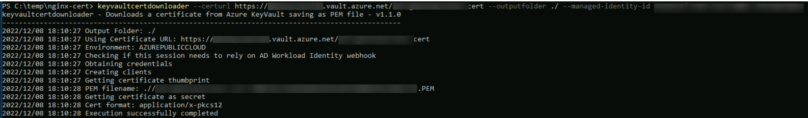

# keyvaultcertdownloader

Source code for a tool that performs downloads managed certificates from KeyVault in PEM file format, these certificates can be self-signed or issued by an Azure KeyVault integrated CA (e.g. Digicert).

> Note: This tool is provided as sample code purposes only, no support of any kind will be provided, for more details, please see [LICENSE](./LICENSE).

## Requirements
* Azure Subscription
* Azure Key Vault
* Certificate managed through Key Vault (self-signed or issued by integrated CA)
* Identity used to authenticate with the tool must have the following access policy set up in KeyVault:
    * Secret -> Get
    * Certificate -> Get


## What does the tool do
It gets a certificate from KeyVault using authentication based on your environment:

### Authentication Methods

The tool supports multiple authentication methods with production-safe defaults:

#### 1. Production Environments (Recommended)
For production deployments, always use **Managed Identity** authentication:

**System Managed Identity:**
```bash
# Set environment variable for production
export AZURE_CREDENTIAL_TYPE=ManagedIdentity

# Or use the command-line flag
./keyvaultcertdownloader --certurl https://mykeyvault.vault.azure.net/vm-cert --outputfolder /output --use-system-managed-identity
```

**User Managed Identity:**
```bash
# Using Client ID
./keyvaultcertdownloader --certurl https://mykeyvault.vault.azure.net/vm-cert --outputfolder /output --managed-identity-id <client-id>

# Or using Resource ID
./keyvaultcertdownloader --certurl https://mykeyvault.vault.azure.net/vm-cert --outputfolder /output --managed-identity-id /subscriptions/<sub-id>/resourcegroups/<rg>/providers/Microsoft.ManagedIdentity/userAssignedIdentities/<name>
```

#### 2. Workload Identity (Kubernetes)
When running in Kubernetes with Azure Workload Identity configured, the tool automatically uses federated tokens:
- Requires: `AZURE_FEDERATED_TOKEN_FILE`, `AZURE_CLIENT_ID`, `AZURE_TENANT_ID`, `AZURE_AUTHORITY_HOST` environment variables
- These are injected automatically by the Azure Workload Identity webhook

#### 3. Development/Testing Environments Only
For local development and testing, you must **explicitly opt-in** to use `DefaultAzureCredential`:

```bash
# Set for development/testing ONLY - explicit opt-in required
export AZURE_CREDENTIAL_TYPE=dev

# This will try multiple credential sources in order:
# 1. Environment variables (AZURE_CLIENT_ID, AZURE_CLIENT_SECRET, AZURE_TENANT_ID)
# 2. Managed Identity (if available)
# 3. Azure CLI credentials
# 4. Azure PowerShell credentials
```

**⚠️ WARNING:** `DefaultAzureCredential` should **NEVER** be used in production environments as it:
- Can cause latency issues during managed identity service outages
- May trigger security alerts due to probing multiple credential sources
- Does not provide deterministic authentication behavior required for production

### Environment Variables

| Variable | Purpose | Required | Production Safe |
|----------|---------|----------|-----------------|
| `AZURE_CREDENTIAL_TYPE` | Controls credential selection: `ManagedIdentity` (production) or `dev` (development only) | No* | Yes (when set to `ManagedIdentity`) |
| `AZURE_FEDERATED_TOKEN_FILE` | Path to federated token (auto-injected in Kubernetes) | No | Yes |
| `AZURE_CLIENT_ID` | Client ID for workload identity or service principal | No** | Yes (with workload identity) |
| `AZURE_TENANT_ID` | Tenant ID for workload identity or service principal | No** | Yes (with workload identity) |
| `AZURE_AUTHORITY_HOST` | Authority host for authentication | No** | Yes (with workload identity) |
| `AZURE_CLIENT_SECRET` | Service principal secret (not recommended) | No | No*** |

\* If not set and no managed identity flags are used, defaults to development mode with a warning  
\*\* Required only when using workload identity  
\*\*\* Using client secrets in environment variables is not recommended for production; use managed identities instead

### Best Practices for Production

1. **Always use Managed Identity** - Set `AZURE_CREDENTIAL_TYPE=ManagedIdentity` or use the `--use-system-managed-identity` flag
2. **Never use DefaultAzureCredential in production** - Only use it for local development/testing
3. **Use Workload Identity in Kubernetes** - Configure Azure Workload Identity for pod-level authentication
4. **Rotate certificates regularly** - Leverage Key Vault's certificate management features
5. **Least privilege access** - Grant only necessary Key Vault permissions (Get Secret, Get Certificate)

After authentication takes place, it first checks if the certificate in KeyVault already exists within the file system through checking the X509Thumbprint (from the certificate bundle) attribute of the cert and check if a file with the following name format already exists:

`<KeyVault CertName>-<bundle thumbprint>.PEM`

Finally, if the certificate from is new, it then extracts the certificate and private from the bundle (leaving CA certs out) and generates the PEM file with the name format described above so it can be consumed by other applications.

> Note: if you need to convert the cert to PFX file after the PEM file is downloaded you can use the following openssl command line to perform the conversion:
> `openssl pkcs12 -inkey <Full path to PEM File> -in<Full path to PEM File> -export -out <Full path for new PFX file>`

### Screenshot


## Parameters

* **certulr** - This is the KeyVault URL followed by the certificate name. E.g. https://mykeyvault.vault.azure.net/vm-cert
* **outputfolder** - Folder where the PEM file with the Certificate and its Private Key will be saved, it must exist beforehand, the tool will not create it and will also not manage permissions on the files
* **version** - shows current tool version
* **managed-identity-id** - Uses user managed identities (accepts resource id or client id). Production-safe.
* **use-system-managed-identity** - Uses system managed identity. Production-safe.

### Environment Variables for Authentication

* **AZURE_CREDENTIAL_TYPE** - Controls authentication mode:
  * Not set (default) - Production mode: uses system managed identity (production-safe default)
  * `ManagedIdentity` - Production mode: explicitly uses system managed identity
  * `dev` - Development mode: uses DefaultAzureCredential (requires explicit opt-in, NOT for production)
* **AZURE_FEDERATED_TOKEN_FILE** - Path to federated token file (auto-configured in Kubernetes with Workload Identity)
* **AZURE_CLIENT_ID** - Required for Workload Identity scenarios
* **AZURE_TENANT_ID** - Required for Workload Identity scenarios
* **AZURE_AUTHORITY_HOST** - Required for Workload Identity scenarios
  
## Exit Error Codes
| Error                      | Exit Code |
|----------------------------|-----------|
| ERR_AUTHORIZER             | 2         |
| ERR_INVALID_ARGUMENT       | 3         |
| ERR_INVALID_URL            | 4         |
| ERR_GET_AKV_CERT_SECRET    | 5         |
| ERR_GET_PEM_PRIVATE_KEY    | 6         |
| ERR_GET_PEM_CERTIFICATE    | 7         |
| ERR_CREATE_PEM_FILE        | 8         |
| ERR_X509_THUMBPRINT        | 9         |
| ERR_OUTPUTFOLDER_NOT_FOUND | 10        |
| ERR_INVALID_AZURE_ENVIRONMENT | 11 |
| ERR_CREDENTIALS | 12 |
| ERR_INVALID_CREDENTIAL_ARGS | 13 |


# Related Information
* [Managed Identities For Azure Resources](https://docs.microsoft.com/en-us/azure/active-directory/managed-identities-azure-resources/overview)
* [Provide Key Vault authentication with an access control policy](https://docs.microsoft.com/en-us/azure/key-vault/key-vault-group-permissions-for-apps)
* [Azure Key Vault Documentation](https://docs.microsoft.com/en-us/azure/key-vault/)

# Contribute
This project welcomes contributions and suggestions.  Most contributions require you to agree to a
Contributor License Agreement (CLA) declaring that you have the right to, and actually do, grant us
the rights to use your contribution. For details, visit https://cla.opensource.microsoft.com.

When you submit a pull request, a CLA bot will automatically determine whether you need to provide
a CLA and decorate the PR appropriately (e.g., status check, comment). Simply follow the instructions
provided by the bot. You will only need to do this once across all repos using our CLA.

This project has adopted the [Microsoft Open Source Code of Conduct](https://opensource.microsoft.com/codeofconduct/).
For more information see the [Code of Conduct FAQ](https://opensource.microsoft.com/codeofconduct/faq/) or
contact [opencode@microsoft.com](mailto:opencode@microsoft.com) with any additional questions or comments.
